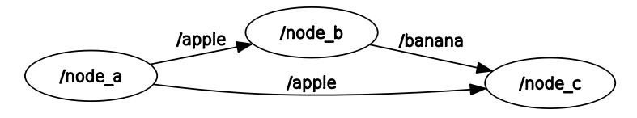

# WATonomous ROS Template

This project contains an isolated ros workspace containing 3 nodes in two packages: package_1 and package_2. This repo was used to teach members new to WATO the basic tools of ROS and how WATonomous utilizes them.

To start off, please take a look at https://www.rosroboticslearning.com/basics-of-ros

```
WATO_ROS_TEMPLATE
├── CMakeLists.txt -> /opt/ros/noetic/share/catkin/cmake/toplevel.cmake
├── launch_package
│   ├── CMakeLists.txt
│   ├── launch_files
│   │   └── ros_template.launch
│   └── package.xml
├── package_1
│   ├── CMakeLists.txt
│   ├── msg
│   │   └── Custom.msg
│   ├── package.xml
│   └── src
│       ├── nodea.py
│       └── nodeb.py
└── package_2
    ├── CMakeLists.txt
    ├── package.xml
    └── src
        └── nodec.py
```
## System Overview Publisher and Subscriber


### Node A is a publisher node. 

It manifests a message and sends it into the ROS system via a ROSTopic (in this case through the communication pipeline called /apple). There, other nodes can subscribe to the topic "/apple" and read the messages sent by Node A. Node A also uses a custom message, which is built using catkin.

### Node B is both a subscriber and publisher node.

It reads the messages coming from Node A and publishes a message of its own (to topic "/banana") using one of ROS's included messages from geometry msgs (Accel). This is to show you that a node can be both a Publisher AND Subscriber, the sky is the limit!

Another thing to keep in mind is that Node B publishes in response to Node A. This is because Node B publishes on every call of the Subscriber callback.

### Node C is a subsriber node.

It reads the messages coming from Node A and Node B, and simply outputs the values of both messages coming from topics "/apple" and "/banana".

---
Some Commands worth knowing for ROS development
``` bash
roscore # to initialize the ROS system and let you begin running ROS nodes

source /opt/ros/noetic/setup.bash # great for when you've never built the workspace before
source devel/setup.bash # for when you've built the workspace before, it does the same thing as the previous command but also sources your built packages on top of it

catkin init # to create your first ever workspace, it contains the top level CMakeLists.txt for catkin to build properly
catkin build # to build the workspace, use this on the root directory (/wato_rostemplate)
catkin_create_pkg <package_name> <package_dependencies> # to autogenerate a package. package dependencies include other std_msgs, geometry_msgs, or other built ros packages 

rosrun <package_name> <executable> # to run a specific node in a package
roslaunch <package_name> <launch_file> # to run a group of nodes instructed by the launchfile
roslaunch-logs # to find the directory of all the ros logs for each node

rostopic list # to see a list of topics currently in use
rostopic echo <topic_name> # to get a live view of the messages being sent into the topic

rosparam list # to get a list of all the parameters currently in the ROS param server, Note: params stay set in the param server even after the launchfile stops running
rosparam delete <param_name> # to delete a specific param from the ROS param server
```